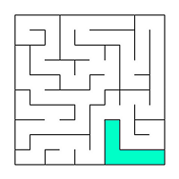
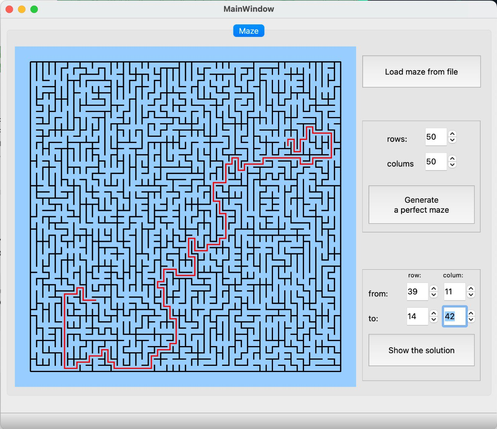

# Maze_CPP_Qt

В данном проекте знакомимся с лабиринтами и основными алгоритмами их обработки, такими как: генерация, отрисовка, поиск решения.

Лабиринт с «тонкими стенками» представляет собой таблицу размером _n_ строк на _m_ столбцов. 
Между ячейками таблицы находятся «стены». Также «стенами» окружена вся таблица в целом. 


Решением лабиринта считается кратчайший путь от заданной начальной точки (ячейки таблицы) до конечной. 
При прохождении лабиринта можно передвигаться к соседним ячейкам, не отделенным «стеной» от текущей ячейки и находящимся сверху, снизу, справа или слева. 
Кратчайшим маршрут считается, если он проходит через наименьшее число ячеек.

## Описание лабиринта

Лабиринт может храниться в файле в виде количества строк и столбцов, а также двух матриц, содержащих положение вертикальных и горизонтальных стен соответственно. 
В первой матрице отображается наличие стены справа от каждой ячейки, а во второй - снизу. 

Пример подобного файла:  
```
4 4
0 0 0 1
1 0 1 1
0 1 0 1
0 0 0 1

1 0 1 0
0 0 1 0
1 1 0 1
1 1 1 1
```

Лабиринт, описанный в этом файле: \


## Недостатки лабиринтов

К недостаткам лабиринтов относятся изолированные области и петли.

Изолированная область - это часть лабиринта с проходами, в которые нельзя попасть из оставшейся части лабиринта. Например: \


Петля - это часть лабиринта с проходами, по которым можно ходить «кругами». Стены в петлях не соединены со стенами, окружающими лабиринт. Например: \


## Интерфейс



## Реализация проекта

- Программа разработана на языке C++ стандарта C++17
- Код программы находится в папке src
- Код соответствует Google Style
- Сборка программы настроена с помощью Makefile со стандартным набором целей для GNU-программ: all, install, uninstall, clean, dvi, dist, tests. Установка ведётся в каталог build в директории проекта
- Программа реализована с использованием паттерна MVC, то есть:
    - отсутствует код бизнес-логики в коде представлений;
    - отсутствует код интерфейса в контроллере и в модели;
    - контроллер - тонкий;
- Классы реализованы внутри пространства имен maze.
- В программе реализован графический пользовательский интерфейс на базе фреймворка Qt
- В программе предусмотрена кнопка для загрузки лабиринта из файла, который задается в формате, описанном [выше](#описание-лабиринта) 
- Максимальный размер лабиринта - 50х50
- Загруженный лабиринт отрисовывается на экране в поле размером 500 x 500 пикселей
- Толщина «стены» - 2 пикселя
- Размер самих ячеек лабиринта вычисляется таким образом, чтобы лабиринт занимал всё отведенное под него поле

### Генерация идеального лабиринта

Добавлена возможность автоматической генерации идеального лабиринта. \
Идеальным считается лабиринт, в котором из каждой точки можно попасть в любую другую точку ровно одним способом.

- Генерируется лабиринт согласно **алгоритму Эллера**
- Сгенерированный лабиринт не должен иметь изолированных областей и петель
- Обеспечено полное покрытие unit-тестами модуля генерации идеального лабиринта с помощью библиотеки GoogleTest
- Пользователем вводится только размерность лабиринта: количество строк и столбцов
- Сгенерированный лабиринт сохраняется в файл в формате, описанном [выше](#описание-лабиринта) 
- Созданный лабиринт отображается на экране как указано в [выше](#реализация-проекта)

### Решение лабиринта

Добавлена возможность показать решение _любого_ лабиринта, который сейчас изображен на экране:
- Пользователем задаются начальная и конечная точки
- Маршрут, являющийся решением, отображается красной линией толщиной 2 пикселя, проходящей через середины всех ячеек лабиринта, через которые пролегает решение
- Обеспечено полное покрытие unit-тестами модуля решения лабиринта с помощью библиотеки GoogleTest


<br>

---

Над проектом работала команда в составе:

- [Маргарита](https://github.com/Marg-S)
- Ильнар